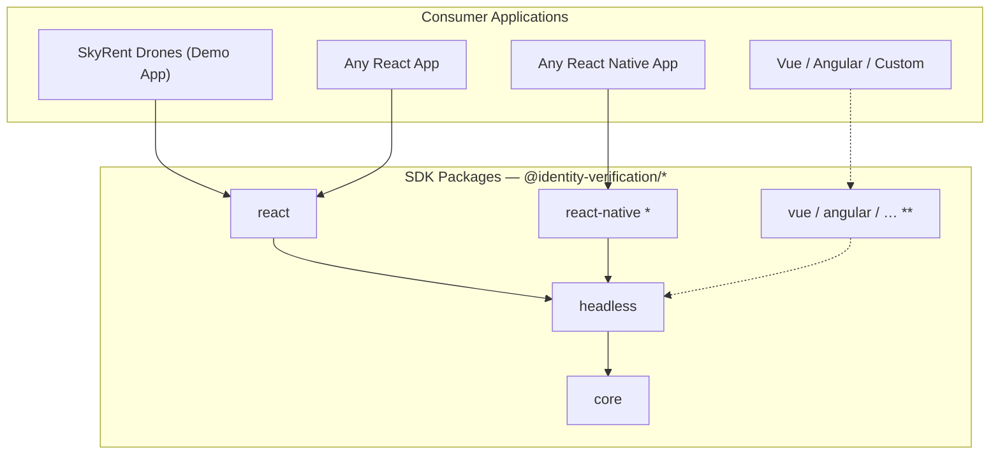

# Identity Verification SDK + SkyRent Drones

A layered identity verification SDK with a demo drone rental application showcasing its integration.

## Architecture



> **\*** proof of concept — **\*\*** hypothetical — **- - ->** potential extension path

The SDK is split into three layers so each can be consumed independently:

**`@identity-verification/core`** — Pure TypeScript. Types, validation (phone, address), verification scoring, and country data. Zero runtime dependencies; runs in any JS environment.

**`@identity-verification/headless`** — Platform-agnostic state machines, camera/permission adapters (browser + React Native), and theme-to-CSS-custom-property mapping. Sits between `core` and the UI packages so the same logic drives both web and mobile.

**`@identity-verification/react`** — React components (`SelfieCapture`, `PhoneInput`, `AddressForm`, `VerificationFlow`), theming via CSS custom properties, and camera hooks. Peer-depends on React 18+.

**`@identity-verification/react-native`** *(proof of concept)* — React Native mirror of the React SDK built on top of `headless`. Included to demonstrate that the architecture extends to mobile; not part of the current deliverable.

**`apps/web`** — SkyRent Drones demo application that integrates the SDK end-to-end.

### Monorepo Structure

```
identity-verification-sdk/
  packages/
    core/               # @identity-verification/core  — Pure TypeScript
    headless/           # @identity-verification/headless — State machines & adapters
    react/              # @identity-verification/react — React components
    react-native/       # @identity-verification/react-native — React Native (proof of concept)
  apps/
    web/                # SkyRent Drones demo app
```

## Quick Start

### Prerequisites

- Node.js 18+
- pnpm 10+

### Install & Run

```bash
pnpm init             # Install deps, build all packages, then start dev (one command)
# or step by step:
pnpm install
pnpm build            # One-time build so downstream packages have type declarations
pnpm dev
```

`pnpm dev` builds each package's dependencies first (via Turborepo's `dependsOn: ["^build"]`), then starts watch mode:
- **core**: `tsup --watch` (rebuilds on TS changes)
- **headless**: `tsup --watch`
- **react**: `vite build --watch` (rebuilds on TSX/CSS changes)
- **web**: Vite dev server at `http://localhost:3000`

### Build

```bash
pnpm build         # Build all packages (core → headless → react → web)
```

### Test

```bash
pnpm test:unit     # Vitest unit tests (core + headless + react + web)
pnpm test:e2e      # Playwright E2E tests (starts dev server automatically)
```

Unit tests cover SDK validation, scoring, state machines, React components, and demo app stores/hooks/utilities. E2E tests cover the full user flow across Chromium, Firefox, and WebKit, including responsive viewports.

### Release (Changesets)

The monorepo is pre-configured with [Changesets](https://github.com/changesets/changesets) for versioning and publishing. No changesets have been generated yet — the tooling is in place for when the packages are ready for their first release.

```bash
pnpm changeset          # Create a changeset describing your change
pnpm version-packages   # Consume changesets, bump versions, update changelogs
pnpm release            # Build all packages and publish to npm
```

### Other Commands

```bash
pnpm lint          # ESLint
pnpm typecheck     # TypeScript type checking
pnpm format        # Prettier formatting
```

## SDK API Reference

### Core Package (`@identity-verification/core`)

#### `getIdentityData(input, options?)`

Main orchestrator. Validates all input fields, simulates API latency, generates a randomized verification score, and returns the final identity data object.

```typescript
import { getIdentityData } from '@identity-verification/core';

const result = await getIdentityData({
  selfie: 'data:image/jpeg;base64,...',
  phone: '4155552671',
  countryCode: 'US',
  address: { street: '123 Main St', city: 'SF', state: 'CA', country: 'US', postalCode: '94102' }
});
// → { selfieUrl, phone: '+14155552671', address, score: 85, status: 'verified' }
```

**Return format:**

| Field | Type | Description |
|-------|------|-------------|
| `selfieUrl` | `string` | Base64 image data URL |
| `phone` | `string` | E.164 format (e.g. `+14155552671`) |
| `address` | `Address` | `{ street, city, state, country, postalCode }` |
| `score` | `number` | 0–100 |
| `status` | `'verified' \| 'failed'` | `'verified'` if score >= 50, `'failed'` otherwise |

**Options:**

| Option | Type | Default | Description |
|--------|------|---------|-------------|
| `simulatedLatencyMs` | `number` | `1500` | Simulated API delay. Set `0` for tests. |
| `seed` | `number` | — | Deterministic scoring seed for tests. |

#### Verification Scoring

`generateVerificationScore(seed?)` produces scores with a weighted distribution:
- **~30% chance** of failure (score 0–49)
- **~70% chance** of success (score 50–100)

The function uses a first random draw to determine pass/fail, then a second draw within the appropriate range. An optional `seed` parameter enables deterministic output for tests via a Mulberry32 PRNG.

#### `validatePhone(phone, countryCode)`

Returns `{ valid, errors }` for a phone number against country-specific rules (digit count, format).

#### `validateAddress(address, countryCode?)`

Returns `{ valid, errors }` with per-field validation including country-specific postal code regex matching.

#### `normalizeToE164(phone, countryCode)`

Converts a local phone number to E.164 format (e.g. `(415) 555-2671` → `+14155552671`).

#### `COUNTRIES`

Static dataset of ~20 countries with dial codes, flag emojis, phone length rules, and postal regex patterns.

### React Package (`@identity-verification/react`)

#### Components

| Component | Props | Description |
|-----------|-------|-------------|
| `SelfieCapture` | `onCapture`, `facingMode?`, `imageQuality?`, `guideShape?`, `onError?` | Camera capture with face guide overlay |
| `PhoneInput` | `onChange`, `defaultCountry?`, `value?`, `onValidationChange?` | Phone input with country selector dropdown |
| `AddressForm` | `onChange`, `defaultCountry?`, `value?`, `onValidationChange?` | 5-field address form with country-driven postal validation |
| `VerificationFlow` | `onComplete`, `onResult?`, `onStepChange?`, `onError?`, `verificationOptions?` | Full orchestrated 3-step wizard (selfie → phone → address → verify) |
| `ThemeProvider` | `theme?` | Applies custom theme via CSS custom properties |
| `StepIndicator` | `currentStep` | Progress indicator for verification steps |

#### Usage: Manual Composition

```tsx
import { SelfieCapture, PhoneInput, AddressForm } from '@identity-verification/react';
import { getIdentityData } from '@identity-verification/core';
import '@identity-verification/react/styles.css';

<SelfieCapture onCapture={(base64) => setSelfie(base64)} />
<PhoneInput onChange={(phone, country) => setPhone(phone)} />
<AddressForm onChange={(address) => setAddress(address)} />

const result = await getIdentityData({ selfie, phone, countryCode, address });
```

#### Usage: Orchestrated Flow

```tsx
import { VerificationFlow, ThemeProvider } from '@identity-verification/react';
import '@identity-verification/react/styles.css';

<ThemeProvider theme={{ colors: { primary: '#7c3aed' } }}>
  <VerificationFlow
    onComplete={(result) => handleVerified(result)}
    onStepChange={(step) => trackAnalytics(step)}
    verificationOptions={{ simulatedLatencyMs: 1500 }}
  />
</ThemeProvider>
```

#### Usage: Orchestrated Flow With `onResult`

When `onResult` is provided, the component hands control to the consumer after verification. Instead of showing its built-in complete/failed screens, it stays on the loading spinner while the consumer navigates away or renders its own result UI.

```tsx
<VerificationFlow
  onComplete={() => {}}
  onResult={(result) => {
    saveResult(result);
    navigate('/result');
  }}
/>
```

**`onResult` props behavior:**

| Prop | Without `onResult` | With `onResult` |
|------|-------------------|-----------------|
| `onComplete` | Called on success, then shows built-in success screen | Called on success (still fires for backward compatibility) |
| `onResult` | — | Called for **both** success and failure |
| After verification | Shows built-in complete/failed screen | Stays on loading spinner; consumer controls navigation |

## Theming

SDK components use CSS custom properties with `--iv-` prefix. All have fallback values, so **ThemeProvider is optional**.

### Option 1: ThemeProvider (JS)

```tsx
<ThemeProvider theme={{
  colors: { primary: '#7c3aed', primaryHover: '#6d28d9' },
  borderRadius: '12px'
}}>
  <VerificationFlow onComplete={handleResult} />
</ThemeProvider>
```

### Option 2: CSS Override

```css
.my-verification {
  --iv-color-primary: #7c3aed;
  --iv-color-primary-hover: #6d28d9;
  --iv-border-radius: 12px;
}
```

### Available Tokens

| Token | Default | Description |
|-------|---------|-------------|
| `--iv-color-primary` | `#0066ff` | Primary action color |
| `--iv-color-primary-hover` | `#0052cc` | Primary hover state |
| `--iv-color-error` | `#dc2626` | Error text/borders |
| `--iv-color-success` | `#16a34a` | Success indicators |
| `--iv-color-text` | `#111827` | Primary text |
| `--iv-color-text-secondary` | `#6b7280` | Secondary text |
| `--iv-color-background` | `#ffffff` | Background |
| `--iv-color-surface` | `#f9fafb` | Elevated surfaces |
| `--iv-color-border` | `#e5e7eb` | Borders |
| `--iv-border-radius` | `8px` | Border radius |
| `--iv-font-family` | `system-ui` | Font family |
| `--iv-spacing-xs` through `--iv-spacing-xl` | `4px`–`32px` | Spacing scale |

## Bundle Size & Tree-shaking

The React SDK ships with `preserveModules` enabled, so each component is a separate file. Consuming bundlers only pull in the code they need — importing `PhoneInput` never pulls in camera/selfie code.

| Import | Brotli | Gzip |
| --- | ---: | ---: |
| Full SDK (all exports) | ~7.5 kB | ~9.8 kB |
| `{ PhoneInput }` | ~2.7 kB | ~3.1 kB |
| `{ SelfieCapture }` | ~1.7 kB | ~2.0 kB |
| `{ AddressForm }` | ~2.7 kB | ~3.1 kB |
| CSS (`styles.css`) | ~2.4 kB | ~2.8 kB |

Sizes exclude peer dependencies (`react`, `react-dom`) and sibling SDK packages.

Bundle budgets are enforced via [size-limit](https://github.com/ai/size-limit), and a tree-shaking verification script confirms no cross-component code leakage.

```bash
pnpm size              # Report sizes for @identity-verification/react
pnpm size:check        # Fail if any budget is exceeded
pnpm verify:treeshake  # Prove PhoneInput doesn't pull in camera code
```

## Demo App — SkyRent Drones

### User Flow

```
/ (Catalog) → /cart → /verify        → /verify/result → /checkout → /checkout/confirmation
                    → /verify/auto   ↗
```

1. **Browse & Select** — Drone catalog with category tabs (Filming / Cargo), daily pricing, specs, and a day-count stepper. Add drones to cart.
2. **Identity Verification** — Two modes: *custom demo* (`/verify`) manually composes SDK primitives, while *drop-in demo* (`/verify/auto`) uses the `VerificationFlow` orchestrated component with `onResult`. Both routes feed into the same result page.
3. **Verification Result** — Displays selfie, phone, address, score bar, and pass/fail status. If failed, user can retry or return to cart. If passed, proceed to checkout.
4. **Checkout** — Order summary with selected drones, rental duration, total price, and verified identity card. "Complete Rental" button confirms the order.
5. **Confirmation** — Order ID, itemized receipt, and a link to browse more drones.

### Demo App Highlights

| Feature | Implementation |
|---------|---------------|
| State management | Zustand with persistence (cart → `localStorage`, verification → `sessionStorage`) |
| Routing | React Router v7 with lazy-loaded pages and route guards (`useRouteGuard`) |
| Error handling | App-level `ErrorBoundary` + component-level boundary around verification |
| Accessibility | `aria-live` announcer for step transitions, cart changes, and item removal; `RouteGuardPending` loading state instead of flash-of-nothing |
| Verification modes | Custom demo (`/verify`, manual composition) + drop-in demo (`/verify/auto`, orchestrated `VerificationFlow` with `onResult`) |
| Code splitting | `React.lazy` for all pages except the catalog (first paint) |
| UI | Tailwind v4 + shadcn/ui (Radix primitives) + Lucide icons |

## Tech Stack

| Concern | Choice |
|---------|--------|
| Monorepo | pnpm workspaces + Turborepo |
| Language | TypeScript (strict) |
| Core build | tsup (ESM + CJS + .d.ts) |
| React build | Vite library mode (CSS Modules + ESM + CJS + .d.ts) |
| Component styling | CSS Modules + CSS custom properties |
| Demo app | Vite + React 19 + Tailwind v4 + shadcn/ui |
| State | Zustand 5 |
| Routing | React Router v7 |
| Unit tests | Vitest + React Testing Library |
| E2E tests | Playwright (Chromium, Firefox, WebKit) |
| Bundle analysis | size-limit |
| Versioning | Changesets |

## Browser Support

| Browser | Minimum Version |
|---------|----------------|
| Chrome | 80+ |
| Firefox | 78+ |
| Safari | 14.1+ |
| Edge | 80+ (Chromium) |

Camera access (`getUserMedia`) requires HTTPS in production. The dev server works on `localhost` without HTTPS.
