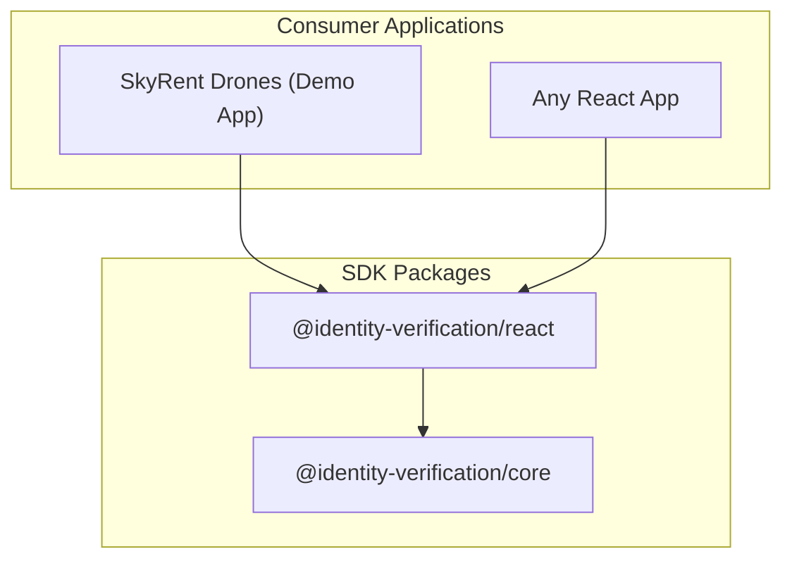

# Identity Verification SDK + SkyRent Drones

A layered identity verification SDK with a demo drone rental application showcasing its usage.

## Architecture



**`@identity-verification/core`** — Pure TypeScript. Types, validation (phone, address), scoring, country data. Zero dependencies, runs in any JS environment.

**`@identity-verification/react`** — React components (SelfieCapture, PhoneInput, AddressForm, VerificationFlow), theming via CSS custom properties, camera hooks. Peer-depends on React 18+.

**`apps/web`** — SkyRent Drones demo app. Vite + React + Tailwind v4 + shadcn/ui + Zustand + React Router.

### Monorepo Structure

```
incode-task/
  packages/
    core/               # @identity-verification/core — Pure TypeScript
    react/              # @identity-verification/react — React components
  apps/
    web/                # SkyRent Drones demo app
```

## Quick Start

### Prerequisites

- Node.js 18+
- pnpm 10+

### Install & Run

```bash
pnpm install
pnpm dev
```

This starts all packages in dev/watch mode via Turborepo:
- **core**: `tsup --watch` (rebuilds on TS changes)
- **react**: `vite build --watch` (rebuilds on TSX/CSS changes)
- **web**: Vite dev server at `http://localhost:5173`

### Build

```bash
pnpm build         # Build all packages (core → react → web)
```

### Test

```bash
pnpm test:unit     # Vitest unit tests (core + react)
pnpm test:e2e      # Playwright E2E tests (starts dev server automatically)
```

### Other Commands

```bash
pnpm lint          # ESLint
pnpm typecheck     # TypeScript type checking
pnpm format        # Prettier formatting
```

## SDK API Reference

### Core Package (`@identity-verification/core`)

#### `getIdentityData(input, options?)`

Main orchestrator. Validates input, generates a score, returns identity data.

```typescript
import { getIdentityData } from '@identity-verification/core';

const result = await getIdentityData({
  selfie: 'data:image/jpeg;base64,...',
  phone: '4155552671',
  countryCode: 'US',
  address: { street: '123 Main St', city: 'SF', state: 'CA', country: 'US', postalCode: '94102' }
});

// result: { selfieUrl, phone, address, score, status: 'verified' | 'failed' }
```

**Options:**
| Option | Type | Default | Description |
|--------|------|---------|-------------|
| `simulatedLatencyMs` | `number` | `1500` | Simulated API delay. Set `0` for tests. |
| `seed` | `number` | — | Deterministic scoring for tests. |

#### `validatePhone(phone, countryCode)`

Returns `{ valid, errors }` for a phone number against country rules.

#### `validateAddress(address, countryCode?)`

Returns `{ valid, errors }` with per-field validation.

#### `COUNTRIES`

Static dataset of ~20 countries with dial codes, flag emojis, phone length rules, and postal regex patterns.

### React Package (`@identity-verification/react`)

#### Components

| Component | Props | Description |
|-----------|-------|-------------|
| `SelfieCapture` | `onCapture`, `facingMode?`, `imageQuality?`, `guideShape?`, `onError?` | Camera capture with face guide overlay |
| `PhoneInput` | `onChange`, `defaultCountry?`, `value?`, `onValidationChange?` | Phone input with country selector dropdown |
| `AddressForm` | `onChange`, `defaultCountry?`, `value?`, `onValidationChange?` | 5-field address form with country-driven postal validation |
| `VerificationFlow` | `onComplete`, `onStepChange?`, `onError?`, `verificationOptions?` | Full orchestrated 3-step wizard (selfie → phone → address → verify) |
| `ThemeProvider` | `theme?` | Applies custom theme via CSS custom properties |
| `StepIndicator` | `currentStep` | Progress indicator for verification steps |

#### Usage: Manual Composition

```tsx
import { SelfieCapture, PhoneInput, AddressForm } from '@identity-verification/react';
import { getIdentityData } from '@identity-verification/core';
import '@identity-verification/react/styles.css';

// Compose individually — full control over layout and flow
<SelfieCapture onCapture={(base64) => setSelfie(base64)} />
<PhoneInput onChange={(phone, country) => setPhone(phone)} />
<AddressForm onChange={(address) => setAddress(address)} />

// Then call getIdentityData() when ready
const result = await getIdentityData({ selfie, phone, countryCode, address });
```

#### Usage: Orchestrated Flow

```tsx
import { VerificationFlow, ThemeProvider } from '@identity-verification/react';
import '@identity-verification/react/styles.css';

<VerificationFlow
  onComplete={(result) => console.log(result)}
  onStepChange={(step) => console.log('Step:', step)}
  verificationOptions={{ simulatedLatencyMs: 1500 }}
/>
```

## Theming

SDK components use CSS custom properties with `--iv-` prefix. All have fallback values, so **ThemeProvider is optional**.

### Option 1: ThemeProvider (JS)

```tsx
<ThemeProvider theme={{
  colors: { primary: '#7c3aed', primaryHover: '#6d28d9' },
  borderRadius: '12px'
}}>
  <VerificationFlow onComplete={handleResult} />
</ThemeProvider>
```

### Option 2: CSS Override

```css
.my-verification {
  --iv-color-primary: #7c3aed;
  --iv-color-primary-hover: #6d28d9;
  --iv-border-radius: 12px;
}
```

### Available Tokens

| Token | Default | Description |
|-------|---------|-------------|
| `--iv-color-primary` | `#0066ff` | Primary action color |
| `--iv-color-primary-hover` | `#0052cc` | Primary hover state |
| `--iv-color-error` | `#dc2626` | Error text/borders |
| `--iv-color-success` | `#16a34a` | Success indicators |
| `--iv-color-text` | `#111827` | Primary text |
| `--iv-color-text-secondary` | `#6b7280` | Secondary text |
| `--iv-color-background` | `#ffffff` | Background |
| `--iv-color-surface` | `#f9fafb` | Elevated surfaces |
| `--iv-color-border` | `#e5e7eb` | Borders |
| `--iv-border-radius` | `8px` | Border radius |
| `--iv-font-family` | `system-ui` | Font family |
| `--iv-spacing-xs` through `--iv-spacing-xl` | `4px`–`32px` | Spacing scale |

## Bundle Size & Tree-shaking

The React SDK ships with `preserveModules` enabled, so each component is a separate file. Consuming bundlers only pull in the code they need — importing `PhoneInput` never pulls in camera/selfie code.

| Import | Brotli | Gzip |
| --- | ---: | ---: |
| Full SDK (all exports) | ~7.5 kB | ~9.8 kB |
| `{ PhoneInput }` | ~2.7 kB | ~3.1 kB |
| `{ SelfieCapture }` | ~1.7 kB | ~2.0 kB |
| `{ AddressForm }` | ~2.7 kB | ~3.1 kB |
| CSS (`styles.css`) | ~2.4 kB | ~2.8 kB |

Sizes exclude peer dependencies (`react`, `react-dom`) and sibling SDK packages.

Bundle budgets are enforced in CI via [size-limit](https://github.com/ai/size-limit), and a tree-shaking verification script confirms no cross-component code leakage.

```bash
pnpm size              # Report sizes for @identity-verification/react
pnpm size:check        # Fail if any budget is exceeded
pnpm verify:treeshake  # Prove PhoneInput doesn't pull in camera code
```

## Tech Stack

| Concern | Choice |
|---------|--------|
| Monorepo | pnpm workspaces + Turborepo |
| Language | TypeScript (strict) |
| Core build | tsup (ESM + CJS + .d.ts) |
| React build | Vite library mode (CSS Modules + ESM + CJS + .d.ts) |
| Component styling | CSS Modules + CSS custom properties |
| Demo app | Vite + React 18 + Tailwind v4 + shadcn/ui |
| State | Zustand |
| Routing | React Router v7 |
| Unit tests | Vitest + React Testing Library |
| E2E tests | Playwright |

## Demo App Flow

```
/ (Catalog) → /cart → /verify → /verify/result → /checkout → /checkout/confirmation
```

1. Browse and add drones to cart (filming + cargo categories)
2. Proceed to identity verification (selfie → phone → address)
3. View verification result (pass/fail with score)
4. Complete checkout (if verified)

## Browser Support

| Browser | Minimum Version |
|---------|----------------|
| Chrome | 80+ |
| Firefox | 78+ |
| Safari | 14.1+ |
| Edge | 80+ (Chromium) |

Camera access (`getUserMedia`) requires HTTPS in production. The dev server works on `localhost` without HTTPS.
